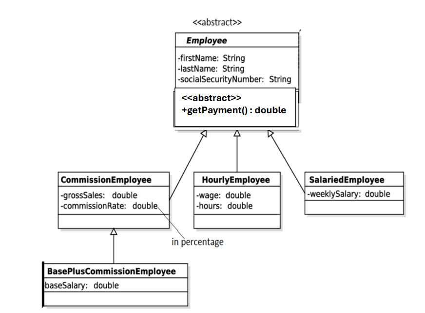

# Employee Salary Management – Abstract class

------------------------------------------------------------------------

## Write a Java code for the given UML Diagram.

------------------------------------------------------------------------

### 1. Provide necessary getters and setters

### 2. Provide necessary constructors to initialize values in all the classes.

### 3. Override the toString() method to display the current status of the objects

### 4. Write a driver class to test by creating an array of five objects for various employee categories.

### 5. Create a static method that takes the array of Employees, and the salary. Return an array of Employees whose getPayment() \< salary. Inside this method deal the logic to avoid NPE. Your result array does not contain null employees.

``` java
public static Employee[] findSalaryList (Employee[] col, double salary) {
}
```

### 6. Print the results on the console.



------------------------------------------------------------------------

### 7.

#### Hints: The getPayment() return double values as mentioned below according to the specific class object.

1.  CommissionEmployee : grossSales \* CommisionRate
2.  BasePlusCommisionEmployee : baseSalary + (grossSales \*
    CommisionRate)
3.  HourlyEmployee : wage \* hours
4.  SalariedEmployee : weeklySalary
